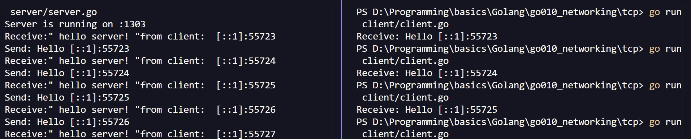

#

## **`Cơ chế hoạt động của TCP trong Go`**

Để thiết lập giao tiếp TCP với Golang, cần 2 thành phần chính:

- `Listerner` / _TCP server_ : có nhiệm vụ chính là lắng nghe kết nối tới một cổng cụ thể và xử lý. Các bước thiết lập TCP server:

  ```go
  // Create tcp server
  listener, err := net.Listen("tcp", "host:port")

  // Waiting for client request
  conn, err := listener.Accept() // blocking, return an object of net.Conn

  // handle request
  go handlerConnection(conn)
  ```

- `Dialer` - _TCP client_ : có nhiệm vụ tạo kết nối tới TCP server, gửi request và nhận phản hồi. Các bước triển khai TCP client:

  ```go
  // gửi yêu cầu kết nối tới TCP server
  conn, err := net.Dial("tcp", "server_host:server_port") // return an object of net.Conn

  // Read/Write data with conn

  // close the connection
  conn.Close()
  ```



#

## **Các phương thức chính của `net.Conn`**

```go

// giả sử ta có
// conn is an instance of net.Conn

// Read
// @params:
//  - b: buffer to read data
// @returns:
//  - n: number of byte read
//  - err: error (if exist)
conn.Read(b []byte) (n int, err error)

// Write
// @params
//  - b: buffer of data to send
// @returns
//  - n: number of byte sent
//  - err
conn.Write(b []byte) (n int, err error)

// Close
conn.Close (err error)

// LocalAddr
// @return
//  - addr: net.Addr => địa chỉ cục bộ của bên gọi (phía mình)
conn.LocalAddr() (addr net.Addr)

// RemoteAddr
// @return
//  - addr: net.Addr => địa chỉ cục bộ của bên nhận (đối phương)
conn.RemoteAddr() (addr net.Addr)

// Timeout
// @param
//  - t : TTL
conn.SetDeadline(t time.Time) (err error)
```

#

## **Các vấn đề nâng cao**

1. ### **`Timeouts`**

   Ngoài `setDeadline(t time.Time)` đặt timeout cho cả 2 chiều Read/Write, có thể set timeout cho 1 chiều:

   - `setReadDeadline(t time.Time)`
   - `setWriteDeadline(t time.Time)`

   Timeout đóng vai trò quan trọng trong ` chống Deadlock`, `tăng khả năng chịu lỗi` khi cho phép server giải phóng tài nguyên với các máy client không hoạt động (quá timeout).

2. ### **`Error Handling` - Xử lý lỗi**

   Hầu hết các phương thức trong _`net.Conn`_ đều trả về _`err error`_. Nguyên tắc là _**luôn kiểm tra giá trị trả về `err` sau mỗi lệnh gọi hàm**_

   ```go
   n, err := conn.Read(buffer)

   if (err != nil) {
    // handling error

    // err == io.EOF -> kết thúc luồng & thoát khỏi vòng lặp đọc
   }

   // do smth if no error is occured
   ```

#

## **`Protocol/Message Framing` - xác định ranh giới giữa các message gửi/nhận**

Vấn đề: Không có sự đảm bảo 1-1 giữa `conn.Read` và `conn.Write` giữa 2 bên.

Các kỹ thuật `Message Framing` chính:

1. _`Delimiter-based Framing`_ kỹ thuật dấu phân cách :  
   Thêm 1 chuỗi byte đặc biệt vào cuỗi mỗi message để đánh dấu sự kết thúc.  
    ex: `\n` thường được sử dụng trong các giao thức `HTTP/1.1`, ...
2. _`Length Prefix Framing`_ - kỹ thuật tiền tố độ dài:  
   Gửi kèm `độ dài của thông điệp` (thường 2-4 bytes) ngay trước khi gửi dữ liệu.  
    ex: bên gửi muốn gửi "hello" -> 5 byte  
    => bên gửi gửi `0005` (4 byte đầu biểu diễn độ dài) + `hello`.  
    => bên nhận đọc 4 bytes đầu để lấy độ dài và đọc lượng bytes tiếp theo bằng đúng độ dài đó.
3. _`Fixed-length Framing`_ - Kỹ thuật độ dài cố định:  
   Tất cả thông điệp đều phải có cùng một độ dài cố định đã được xác định trước. Nếu thông điệp ngắn hơn, nó sẽ được đệm (padding) bằng các byte rỗng.
