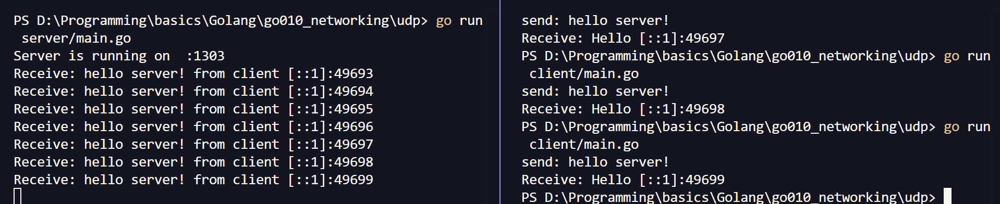

#

## Cấu trúc và hàm cơ bản

### `net.PacketConn`

Là interface được sử dụng để làm việc với các kết nối gói (như UDP), tương đối giống `net.Conn` của TCP.  
Methods:

```go
// Read
// addr: Remote Address
ReadFrom(b []byte) (n int, addr net.Addr, err error)

// Write
// addr: Remote Address
WriteTo(b []byte, addr net.Addr) (n int, err error)

// Quản lý kết nối
Close() error
LocalAddr() net.Addr
SetDeadline(time.Time), SetReadDeadline(time.Time), SetWriteDeadline(time.Timee)
```

#

### `net.UDPAddr`

Cấu trúc đại diện cho một địa chỉ UDP (bao gồm `IP` và `Port`).

#

### `net.ResolverUDPAddr(net, addr string)`

Phân rã 1 chuỗi địa chỉ thành cấu trúc `*netUDPAddr`.  
Tham số `net="udp"`

#

### `net.ListenUDP(net string, laddr *UDPAddr)`

Mở cổng để lắng nghe các datagram tới, trả về `*net.UDPConn`. Có thể dùng cho cả client và server.  
Tham số `net="udp"`  

#

### `net.Dial(net, serverAddr string)`

Mở kết nối từ client tới serverAddr băng giao thức `net="udp"`


